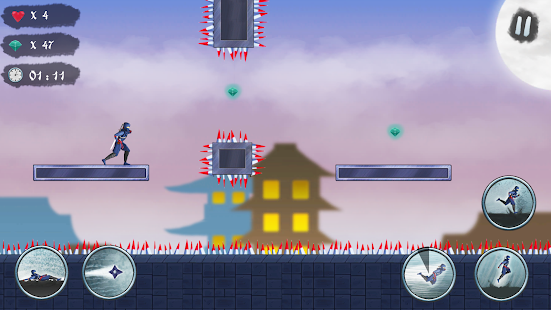
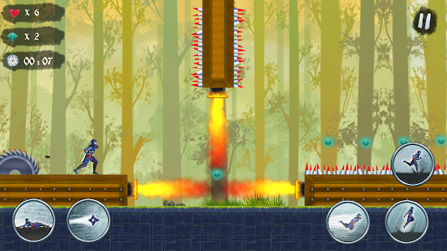
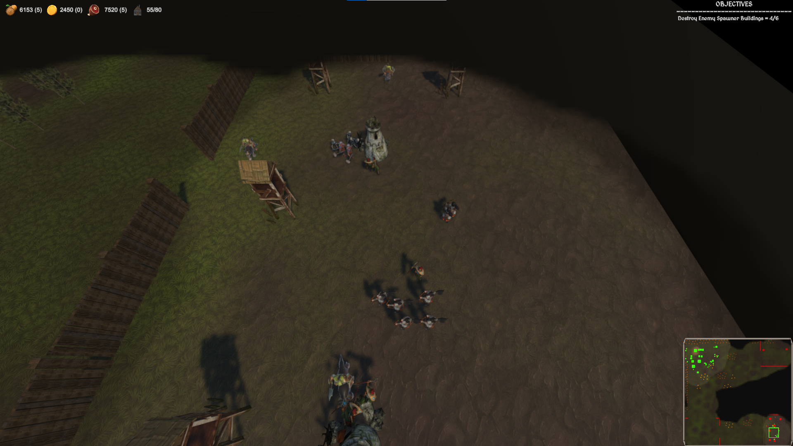

<h1 style = "color:#000000"> <b> Cem Bozkurt, Game Developer </b> </h1>

 <b> Hello, i am game developer, i am making games and game prototypes, you can find some games that i made in below. </b> 

## Ninja Taigen - Platformer Runner

 <b> This is mobile game for android devices and published in google play store. This is runner game with different levels. Player have different skills and facing with various enemies and platform challenges. I made the game as solo developer and made with Unity.</b> 

<a href = "https://play.google.com/store/apps/details?id=com.DomatisGames.NinjaTaigen">Google Play Store Link </a>

### ScreenShots

   

## RTS Game Prototype

 <b> This is RTS game for PC .This is not a full game just a prototype, i made this game for improve my skills and gain experience. There are core rts game features like build structures, resource gathering, produce different types of units from buildings and controlling them. I made the game as solo developer and made with Unity.</b> 

<a href = "https://github.com/Domatis/RTSPrototype">Github Project Link</a> 

<a href = "https://drive.google.com/file/d/1vda5Hx1Lk0lPdAxb6nqd81ikAss3WLzm/view">Game Download Link For Windows</a>

### ScreenShots

## Bounce Skeletons

 <b> This is hypercasual game prototype for mobile devices. This is not a full game just a prototype, i made this game for gain experience on hypercasual mobile games. I made the game as solo developer and made with Unity.</b> 

<a href = "https://github.com/Domatis/BounceSkeletons">Github Project Link(Android Apk Included)</a> 

### ScreenShots

